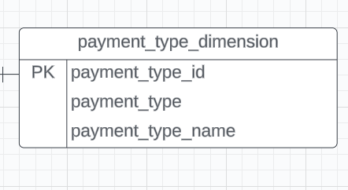
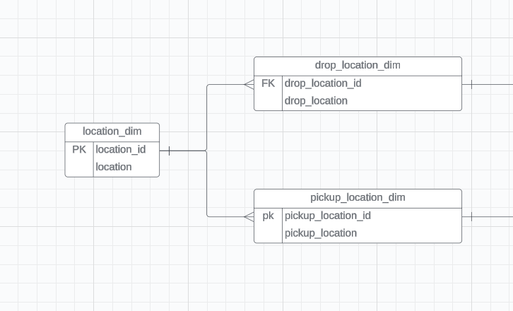

@author: [Danial Shabbir](https://github.com/DanielOX)

Medium Article: https://medium.com/@danial.shabbir77/a-complete-data-engineering-workflow-data-modelling-and-advanced-analytics-using-python-duckdb-af1f63d1f4b8

Reach out to me via linkedin: https://www.linkedin.com/in/data-engineer-d/

Reach out to me via gmail: danial.shabbir77@gmail.com

## Understanding NYC Taxi Trip Data

The New York City Taxi and Limousine Commission (TLC) collect extensive data concerning taxi trips within the city. This data provides a rich resource for analysis and modeling, aiding in various business and urban planning decisions. In this article, we delve into leveraging Jupyter Notebook to dissect and organize this data into meaningful Dimension and Fact tables for analytics purposes.

Dataset Download Link: https://www.nyc.gov/site/tlc/about/tlc-trip-record-data.page

Note: For the purpose of this article we will be using dataset from year 2023 (Yellow Taxi)

## Introduction to the Data

The provided dataset contains detailed records of taxi trips from the year 2023 trips. It captures pivotal information such as pick-up and drop-off dates/times, trip distances, fare details, passenger counts, and more. It's important to note that this data was collected and supplied to the TLC by technology providers under authorized programs. Therefore, while being valuable, the accuracy and completeness of the dataset might not be guaranteed.


## Data Dictionary or Data Catalog
Below image contains all the data points we will getting and their descriptions from the dataset.


## Process Flow of the Pipeline

### Loading and Data Preprocessing 
The analysis starts with loading the data into a Pandas DataFrame within the Jupyter Notebook environment. This initial step involves crucial data preprocessing tasks such as:

- Checking data types and ensuring appropriate formats for date-time columns.
- Removing duplicate entries to maintain data integrity.
- Generating a unique Trip ID for each trip record for identification purposes. (also known as surrogate key)

### Constructing Dimension Tables
Once, the data is fully cleaned. We creates dimension tables for different entities

- **datetime_dim:** This table captures datetime-related attributes such as pickup and drop-off hours, days, months, years, and weekdays.
- **passenger_count_dim:** Contains passenger count information.
- **trip_distance_dim:** Holds details about trip distances.
- **rate_code_dim:** Provides insights into different rate codes and their corresponding names.
- **location_dim:** A look-up table for location which maps locationID for pickup/dropff into location_name
- **pickup_location_dim:** Stores data about pickup locations.
- **dropoff_location_dim:** Holds data regarding drop-off locations.
- **payment_type_dim:** Contains information about various payment types.

### Building the Fact Table

The Fact table, the heart of a dimensional model, is constructed by merging various Dimension tables. It encapsulates essential information such as trip details, fare amounts, payment details, dropoff_location_dim, pickup_location_dim, passenger details and more.

### Diagram of Data Model


### Some Complex Analytics using Our Data Model

We will write some analytical queries using duckdb to query data from our data model. This will present and help us identify different usecases. 


```python
import pandas as pd
import duckdb
```


```python
#load data from parquet file
df =pd.read_parquet('./nyc_taxi_trip_data/2023/2023.parquet')

display(df.head())

print(f'Dataset Contains: {df.shape[0]} rows,  {df.shape[1]} columns')
```


<div>
<style scoped>
    .dataframe tbody tr th:only-of-type {
        vertical-align: middle;
    }

    .dataframe tbody tr th {
        vertical-align: top;
    }

    .dataframe thead th {
        text-align: right;
    }
</style>
<table border="1" class="dataframe">
  <thead>
    <tr style="text-align: right;">
      <th></th>
      <th>VendorID</th>
      <th>tpep_pickup_datetime</th>
      <th>tpep_dropoff_datetime</th>
      <th>passenger_count</th>
      <th>trip_distance</th>
      <th>RatecodeID</th>
      <th>store_and_fwd_flag</th>
      <th>PULocationID</th>
      <th>DOLocationID</th>
      <th>payment_type</th>
      <th>fare_amount</th>
      <th>extra</th>
      <th>mta_tax</th>
      <th>tip_amount</th>
      <th>tolls_amount</th>
      <th>improvement_surcharge</th>
      <th>total_amount</th>
      <th>congestion_surcharge</th>
      <th>airport_fee</th>
    </tr>
  </thead>
  <tbody>
    <tr>
      <th>0</th>
      <td>2</td>
      <td>2023-01-01 00:32:10</td>
      <td>2023-01-01 00:40:36</td>
      <td>1.0</td>
      <td>0.97</td>
      <td>1.0</td>
      <td>N</td>
      <td>161</td>
      <td>141</td>
      <td>2</td>
      <td>9.3</td>
      <td>1.00</td>
      <td>0.5</td>
      <td>0.00</td>
      <td>0.0</td>
      <td>1.0</td>
      <td>14.30</td>
      <td>2.5</td>
      <td>0.00</td>
    </tr>
    <tr>
      <th>1</th>
      <td>2</td>
      <td>2023-01-01 00:55:08</td>
      <td>2023-01-01 01:01:27</td>
      <td>1.0</td>
      <td>1.10</td>
      <td>1.0</td>
      <td>N</td>
      <td>43</td>
      <td>237</td>
      <td>1</td>
      <td>7.9</td>
      <td>1.00</td>
      <td>0.5</td>
      <td>4.00</td>
      <td>0.0</td>
      <td>1.0</td>
      <td>16.90</td>
      <td>2.5</td>
      <td>0.00</td>
    </tr>
    <tr>
      <th>2</th>
      <td>2</td>
      <td>2023-01-01 00:25:04</td>
      <td>2023-01-01 00:37:49</td>
      <td>1.0</td>
      <td>2.51</td>
      <td>1.0</td>
      <td>N</td>
      <td>48</td>
      <td>238</td>
      <td>1</td>
      <td>14.9</td>
      <td>1.00</td>
      <td>0.5</td>
      <td>15.00</td>
      <td>0.0</td>
      <td>1.0</td>
      <td>34.90</td>
      <td>2.5</td>
      <td>0.00</td>
    </tr>
    <tr>
      <th>3</th>
      <td>1</td>
      <td>2023-01-01 00:03:48</td>
      <td>2023-01-01 00:13:25</td>
      <td>0.0</td>
      <td>1.90</td>
      <td>1.0</td>
      <td>N</td>
      <td>138</td>
      <td>7</td>
      <td>1</td>
      <td>12.1</td>
      <td>7.25</td>
      <td>0.5</td>
      <td>0.00</td>
      <td>0.0</td>
      <td>1.0</td>
      <td>20.85</td>
      <td>0.0</td>
      <td>1.25</td>
    </tr>
    <tr>
      <th>4</th>
      <td>2</td>
      <td>2023-01-01 00:10:29</td>
      <td>2023-01-01 00:21:19</td>
      <td>1.0</td>
      <td>1.43</td>
      <td>1.0</td>
      <td>N</td>
      <td>107</td>
      <td>79</td>
      <td>1</td>
      <td>11.4</td>
      <td>1.00</td>
      <td>0.5</td>
      <td>3.28</td>
      <td>0.0</td>
      <td>1.0</td>
      <td>19.68</td>
      <td>2.5</td>
      <td>0.00</td>
    </tr>
  </tbody>
</table>
</div>


    Dataset Contains: 3066766 rows,  19 columns


## Some details about parquet file format

CSV files store data in rows with values separated by delimiters, while JSON uses key-value pairs for structured data. Parquet, however, arranges data by columns, allowing more efficient storage and retrieval of column-specific information. It employs advanced compression techniques and encoding methods, like Run-Length and Dictionary Encoding, resulting in smaller file sizes and faster query performance. This optimized structure makes Parquet well-suited for analytical workloads, big data processing, and data warehousing, as it significantly reduces storage needs and enhances processing speeds compared to CSV and JSON formats.

personal note:
I will always prefer working with parquet format for my analytical projects, even if the source file csv/json, i will always try to convert it into parquet format.


# Preprocessing Steps &  Surrogate Key
We will perform a basic preprocessing step 
 - drop duplicates
 - add a surrogate key 

Each record in dataset represents a trip. we can apply complex hashing (md5, sha256) of concatenating multiple columns to represent a unique record for each trip or we can just assign the monotically increasing id. Both can work, i will be applying monotonically increasing id. Pandas provide this out of the box when we load in the dataframe. it is called `index`.

just for the reference, if some of the folks wants to take hashing route. one can apply the logic as below. please note it's gonna be a little slow

``` python
    import hashlib
    
    def genMd5Hash(*args) -> str:
        string = ''.join([str(arg) for arg in args])
        """ Function to generate md5 when given a string """
        return hashlib.md5(string.encode())
    df['trip_id'] = df.apply(genMd5Hash,axis=1)
    # Just adding for sequence. the trip_id columns would be located at the end, so i will filtered out all the cols except `trip_id`
    cols = list(filter(lambda x: x != 'trip_id', df.columns))
    # combining array in this way ensures `trip_id` is always on the first columns, just for readability purposes
    cols = ['trip_id'] + cols
    
    df[cols].head()
```


```python
df = df.drop_duplicates()
# It will insert `trip_id` to the first location in columns
df.insert(0,'trip_id',df.index)
```


```python
df.head()
```


<div>
<style scoped>
    .dataframe tbody tr th:only-of-type {
        vertical-align: middle;
    }

    .dataframe tbody tr th {
        vertical-align: top;
    }

    .dataframe thead th {
        text-align: right;
    }
</style>
<table border="1" class="dataframe">
  <thead>
    <tr style="text-align: right;">
      <th></th>
      <th>trip_id</th>
      <th>VendorID</th>
      <th>tpep_pickup_datetime</th>
      <th>tpep_dropoff_datetime</th>
      <th>passenger_count</th>
      <th>trip_distance</th>
      <th>RatecodeID</th>
      <th>store_and_fwd_flag</th>
      <th>PULocationID</th>
      <th>DOLocationID</th>
      <th>payment_type</th>
      <th>fare_amount</th>
      <th>extra</th>
      <th>mta_tax</th>
      <th>tip_amount</th>
      <th>tolls_amount</th>
      <th>improvement_surcharge</th>
      <th>total_amount</th>
      <th>congestion_surcharge</th>
      <th>airport_fee</th>
    </tr>
  </thead>
  <tbody>
    <tr>
      <th>0</th>
      <td>0</td>
      <td>2</td>
      <td>2023-01-01 00:32:10</td>
      <td>2023-01-01 00:40:36</td>
      <td>1.0</td>
      <td>0.97</td>
      <td>1.0</td>
      <td>N</td>
      <td>161</td>
      <td>141</td>
      <td>2</td>
      <td>9.3</td>
      <td>1.00</td>
      <td>0.5</td>
      <td>0.00</td>
      <td>0.0</td>
      <td>1.0</td>
      <td>14.30</td>
      <td>2.5</td>
      <td>0.00</td>
    </tr>
    <tr>
      <th>1</th>
      <td>1</td>
      <td>2</td>
      <td>2023-01-01 00:55:08</td>
      <td>2023-01-01 01:01:27</td>
      <td>1.0</td>
      <td>1.10</td>
      <td>1.0</td>
      <td>N</td>
      <td>43</td>
      <td>237</td>
      <td>1</td>
      <td>7.9</td>
      <td>1.00</td>
      <td>0.5</td>
      <td>4.00</td>
      <td>0.0</td>
      <td>1.0</td>
      <td>16.90</td>
      <td>2.5</td>
      <td>0.00</td>
    </tr>
    <tr>
      <th>2</th>
      <td>2</td>
      <td>2</td>
      <td>2023-01-01 00:25:04</td>
      <td>2023-01-01 00:37:49</td>
      <td>1.0</td>
      <td>2.51</td>
      <td>1.0</td>
      <td>N</td>
      <td>48</td>
      <td>238</td>
      <td>1</td>
      <td>14.9</td>
      <td>1.00</td>
      <td>0.5</td>
      <td>15.00</td>
      <td>0.0</td>
      <td>1.0</td>
      <td>34.90</td>
      <td>2.5</td>
      <td>0.00</td>
    </tr>
    <tr>
      <th>3</th>
      <td>3</td>
      <td>1</td>
      <td>2023-01-01 00:03:48</td>
      <td>2023-01-01 00:13:25</td>
      <td>0.0</td>
      <td>1.90</td>
      <td>1.0</td>
      <td>N</td>
      <td>138</td>
      <td>7</td>
      <td>1</td>
      <td>12.1</td>
      <td>7.25</td>
      <td>0.5</td>
      <td>0.00</td>
      <td>0.0</td>
      <td>1.0</td>
      <td>20.85</td>
      <td>0.0</td>
      <td>1.25</td>
    </tr>
    <tr>
      <th>4</th>
      <td>4</td>
      <td>2</td>
      <td>2023-01-01 00:10:29</td>
      <td>2023-01-01 00:21:19</td>
      <td>1.0</td>
      <td>1.43</td>
      <td>1.0</td>
      <td>N</td>
      <td>107</td>
      <td>79</td>
      <td>1</td>
      <td>11.4</td>
      <td>1.00</td>
      <td>0.5</td>
      <td>3.28</td>
      <td>0.0</td>
      <td>1.0</td>
      <td>19.68</td>
      <td>2.5</td>
      <td>0.00</td>
    </tr>
  </tbody>
</table>
</div>


## Data Modelling

Now preprocessing of the data is completed. The next step would be to create data model. 

Some definations of `data model` and `dimnensions` in a layman term

<dl>
  <dt><strong>Data Model</strong></dt> <br>
  <dd>A data model is like a blueprint or a plan that defines how data is organized, structured, and related within a database or system. <br><br>
   <strong>
      Why do we need it?
    </strong>
    </br>
     <p>It helps in understanding the different types of data, their relationships, and how they can be accessed or retrieved.</p>
     </br>
     <strong>
      Analogy
      </strong>
      <p>Imagine you're building a house. Before construction begins, you have architectural plans that detail where rooms will be located, how they connect, and what materials will be used. Similarly, a data model outlines how data will be stored, what types of data are needed, and how different pieces of data relate to each other.</p>
  </dd>
  <br>
  <dt><strong>Dimension</strong></dt> <br>
  <dd>A dimension in a model refers to a way of organizing or categorizing data to help understand and analyze information more effectively. It's like grouping or labeling data based on specific attributes or characteristics.<br><br>
   <strong>
      Why do we need it?
    </strong>
    </br>
     <p>Dimensions provide context and structure to data, making it easier to study and gain insights. They help in organizing information in a meaningful way, allowing users to ask questions and perform analyses that can lead to better decision-making.</p>
      <strong>
        Analogy
      </strong>
      <p>In a sales model, time can be a dimension. You might break down time into years, months, and days to analyze sales performance over different time periods. Similarly, in a customer model, age or location can be dimensions to categorize customers based on their age groups or geographic regions.</p>

  </dd>
</dl>

## Creating `datetime_dim` dimension table

Now lets build the datetime dimension as depicted in the picture. As you can see, i have broken down the time to  minute, hour, day, weekday, month, year for each pickup and dropoff. This is helpful for analysing the information. An analyst is now able to gain visibility upto minute level analytics of trips. This is also called `Granularity` of data. 

### Some notes about Granularity

Granularity in simple terms means `The level of detail at which the attributes and characteristics (columns) of data are defined` so the more we dive deeper the granularity of data becomes (individual level info) and the more we aggregate data the granularity becomes higher (department level info). High Granularity can be related to as seeing a whole picture (bigger view) and low level granularity means seeing individual elements of the whole picture. e.g seeing an individual salary would be lower granular and seeing the department's average salary would be high granular level of detail.


```python
datetime_dim = df[['tpep_pickup_datetime','tpep_dropoff_datetime']].reset_index(drop=True)

# PK
datetime_dim['datetime_id'] = datetime_dim.index


# pickup  datetime
datetime_dim['pick_hour'] = datetime_dim['tpep_pickup_datetime'].dt.hour
datetime_dim['pick_day'] = datetime_dim['tpep_pickup_datetime'].dt.day_name()
datetime_dim['pick_month'] = datetime_dim['tpep_pickup_datetime'].dt.month
datetime_dim['pick_year'] = datetime_dim['tpep_pickup_datetime'].dt.year
datetime_dim['pick_weekday'] = datetime_dim['tpep_pickup_datetime'].dt.weekday

# drop off datetime
datetime_dim['drop_hour'] = datetime_dim['tpep_dropoff_datetime'].dt.hour
datetime_dim['drop_day'] = datetime_dim['tpep_dropoff_datetime'].dt.day_name()
datetime_dim['drop_month'] = datetime_dim['tpep_dropoff_datetime'].dt.month
datetime_dim['drop_year'] = datetime_dim['tpep_dropoff_datetime'].dt.year
datetime_dim['drop_weekday'] = datetime_dim['tpep_dropoff_datetime'].dt.weekday

# giving proper ordering to columns for readability purpose

cols_seq = ['datetime_id', 'tpep_pickup_datetime', 'pick_hour', 'pick_day', 'pick_month', 'pick_year', 'pick_weekday',
             'tpep_dropoff_datetime', 'drop_hour', 'drop_day', 'drop_month', 'drop_year', 'drop_weekday']
datetime_dim = datetime_dim[cols_seq]

display(datetime_dim)
```


<div>
<style scoped>
    .dataframe tbody tr th:only-of-type {
        vertical-align: middle;
    }

    .dataframe tbody tr th {
        vertical-align: top;
    }

    .dataframe thead th {
        text-align: right;
    }
</style>
<table border="1" class="dataframe">
  <thead>
    <tr style="text-align: right;">
      <th></th>
      <th>datetime_id</th>
      <th>tpep_pickup_datetime</th>
      <th>pick_hour</th>
      <th>pick_day</th>
      <th>pick_month</th>
      <th>pick_year</th>
      <th>pick_weekday</th>
      <th>tpep_dropoff_datetime</th>
      <th>drop_hour</th>
      <th>drop_day</th>
      <th>drop_month</th>
      <th>drop_year</th>
      <th>drop_weekday</th>
    </tr>
  </thead>
  <tbody>
    <tr>
      <th>0</th>
      <td>0</td>
      <td>2023-01-01 00:32:10</td>
      <td>0</td>
      <td>Sunday</td>
      <td>1</td>
      <td>2023</td>
      <td>6</td>
      <td>2023-01-01 00:40:36</td>
      <td>0</td>
      <td>Sunday</td>
      <td>1</td>
      <td>2023</td>
      <td>6</td>
    </tr>
    <tr>
      <th>1</th>
      <td>1</td>
      <td>2023-01-01 00:55:08</td>
      <td>0</td>
      <td>Sunday</td>
      <td>1</td>
      <td>2023</td>
      <td>6</td>
      <td>2023-01-01 01:01:27</td>
      <td>1</td>
      <td>Sunday</td>
      <td>1</td>
      <td>2023</td>
      <td>6</td>
    </tr>
    <tr>
      <th>2</th>
      <td>2</td>
      <td>2023-01-01 00:25:04</td>
      <td>0</td>
      <td>Sunday</td>
      <td>1</td>
      <td>2023</td>
      <td>6</td>
      <td>2023-01-01 00:37:49</td>
      <td>0</td>
      <td>Sunday</td>
      <td>1</td>
      <td>2023</td>
      <td>6</td>
    </tr>
    <tr>
      <th>3</th>
      <td>3</td>
      <td>2023-01-01 00:03:48</td>
      <td>0</td>
      <td>Sunday</td>
      <td>1</td>
      <td>2023</td>
      <td>6</td>
      <td>2023-01-01 00:13:25</td>
      <td>0</td>
      <td>Sunday</td>
      <td>1</td>
      <td>2023</td>
      <td>6</td>
    </tr>
    <tr>
      <th>4</th>
      <td>4</td>
      <td>2023-01-01 00:10:29</td>
      <td>0</td>
      <td>Sunday</td>
      <td>1</td>
      <td>2023</td>
      <td>6</td>
      <td>2023-01-01 00:21:19</td>
      <td>0</td>
      <td>Sunday</td>
      <td>1</td>
      <td>2023</td>
      <td>6</td>
    </tr>
    <tr>
      <th>...</th>
      <td>...</td>
      <td>...</td>
      <td>...</td>
      <td>...</td>
      <td>...</td>
      <td>...</td>
      <td>...</td>
      <td>...</td>
      <td>...</td>
      <td>...</td>
      <td>...</td>
      <td>...</td>
      <td>...</td>
    </tr>
    <tr>
      <th>3066761</th>
      <td>3066761</td>
      <td>2023-01-31 23:58:34</td>
      <td>23</td>
      <td>Tuesday</td>
      <td>1</td>
      <td>2023</td>
      <td>1</td>
      <td>2023-02-01 00:12:33</td>
      <td>0</td>
      <td>Wednesday</td>
      <td>2</td>
      <td>2023</td>
      <td>2</td>
    </tr>
    <tr>
      <th>3066762</th>
      <td>3066762</td>
      <td>2023-01-31 23:31:09</td>
      <td>23</td>
      <td>Tuesday</td>
      <td>1</td>
      <td>2023</td>
      <td>1</td>
      <td>2023-01-31 23:50:36</td>
      <td>23</td>
      <td>Tuesday</td>
      <td>1</td>
      <td>2023</td>
      <td>1</td>
    </tr>
    <tr>
      <th>3066763</th>
      <td>3066763</td>
      <td>2023-01-31 23:01:05</td>
      <td>23</td>
      <td>Tuesday</td>
      <td>1</td>
      <td>2023</td>
      <td>1</td>
      <td>2023-01-31 23:25:36</td>
      <td>23</td>
      <td>Tuesday</td>
      <td>1</td>
      <td>2023</td>
      <td>1</td>
    </tr>
    <tr>
      <th>3066764</th>
      <td>3066764</td>
      <td>2023-01-31 23:40:00</td>
      <td>23</td>
      <td>Tuesday</td>
      <td>1</td>
      <td>2023</td>
      <td>1</td>
      <td>2023-01-31 23:53:00</td>
      <td>23</td>
      <td>Tuesday</td>
      <td>1</td>
      <td>2023</td>
      <td>1</td>
    </tr>
    <tr>
      <th>3066765</th>
      <td>3066765</td>
      <td>2023-01-31 23:07:32</td>
      <td>23</td>
      <td>Tuesday</td>
      <td>1</td>
      <td>2023</td>
      <td>1</td>
      <td>2023-01-31 23:21:56</td>
      <td>23</td>
      <td>Tuesday</td>
      <td>1</td>
      <td>2023</td>
      <td>1</td>
    </tr>
  </tbody>
</table>
<p>3066766 rows × 13 columns</p>
</div>


## Creating `passenger_count_dim` dimension table




```python
passenger_count_dim = df[['passenger_count']].reset_index(drop=True)
passenger_count_dim['passenger_count_id'] = passenger_count_dim.index

# giving proper ordering to columns for readability purpose
cols_seq = ['passenger_count_id','passenger_count']
passenger_count_dim = passenger_count_dim[cols_seq]

display(passenger_count_dim)
```


<div>
<style scoped>
    .dataframe tbody tr th:only-of-type {
        vertical-align: middle;
    }

    .dataframe tbody tr th {
        vertical-align: top;
    }

    .dataframe thead th {
        text-align: right;
    }
</style>
<table border="1" class="dataframe">
  <thead>
    <tr style="text-align: right;">
      <th></th>
      <th>passenger_count_id</th>
      <th>passenger_count</th>
    </tr>
  </thead>
  <tbody>
    <tr>
      <th>0</th>
      <td>0</td>
      <td>1.0</td>
    </tr>
    <tr>
      <th>1</th>
      <td>1</td>
      <td>1.0</td>
    </tr>
    <tr>
      <th>2</th>
      <td>2</td>
      <td>1.0</td>
    </tr>
    <tr>
      <th>3</th>
      <td>3</td>
      <td>0.0</td>
    </tr>
    <tr>
      <th>4</th>
      <td>4</td>
      <td>1.0</td>
    </tr>
    <tr>
      <th>...</th>
      <td>...</td>
      <td>...</td>
    </tr>
    <tr>
      <th>3066761</th>
      <td>3066761</td>
      <td>NaN</td>
    </tr>
    <tr>
      <th>3066762</th>
      <td>3066762</td>
      <td>NaN</td>
    </tr>
    <tr>
      <th>3066763</th>
      <td>3066763</td>
      <td>NaN</td>
    </tr>
    <tr>
      <th>3066764</th>
      <td>3066764</td>
      <td>NaN</td>
    </tr>
    <tr>
      <th>3066765</th>
      <td>3066765</td>
      <td>NaN</td>
    </tr>
  </tbody>
</table>
<p>3066766 rows × 2 columns</p>
</div>


## Creating `trip_distance_dim` dimension table


```python
trip_distance_dim = df[['trip_distance']].reset_index(drop=True)
trip_distance_dim['trip_distance_id'] = trip_distance_dim.index


# giving proper ordering to columns for readability purpose
cols_seq = ['trip_distance_id', 'trip_distance']
trip_distance_dim = trip_distance_dim

display(trip_distance_dim)
```


<div>
<style scoped>
    .dataframe tbody tr th:only-of-type {
        vertical-align: middle;
    }

    .dataframe tbody tr th {
        vertical-align: top;
    }

    .dataframe thead th {
        text-align: right;
    }
</style>
<table border="1" class="dataframe">
  <thead>
    <tr style="text-align: right;">
      <th></th>
      <th>trip_distance</th>
      <th>trip_distance_id</th>
    </tr>
  </thead>
  <tbody>
    <tr>
      <th>0</th>
      <td>0.97</td>
      <td>0</td>
    </tr>
    <tr>
      <th>1</th>
      <td>1.10</td>
      <td>1</td>
    </tr>
    <tr>
      <th>2</th>
      <td>2.51</td>
      <td>2</td>
    </tr>
    <tr>
      <th>3</th>
      <td>1.90</td>
      <td>3</td>
    </tr>
    <tr>
      <th>4</th>
      <td>1.43</td>
      <td>4</td>
    </tr>
    <tr>
      <th>...</th>
      <td>...</td>
      <td>...</td>
    </tr>
    <tr>
      <th>3066761</th>
      <td>3.05</td>
      <td>3066761</td>
    </tr>
    <tr>
      <th>3066762</th>
      <td>5.80</td>
      <td>3066762</td>
    </tr>
    <tr>
      <th>3066763</th>
      <td>4.67</td>
      <td>3066763</td>
    </tr>
    <tr>
      <th>3066764</th>
      <td>3.15</td>
      <td>3066764</td>
    </tr>
    <tr>
      <th>3066765</th>
      <td>2.85</td>
      <td>3066765</td>
    </tr>
  </tbody>
</table>
<p>3066766 rows × 2 columns</p>
</div>


## Creating `rate_code_dim` dimension table


if we look in the data dictionary the information about rate code id are provided e.g 1 = 'Standard rate' etc. We can add this meta info in our dimension table to make it more helpful for our analysts.


```python
# Mapping of rate code 
rate_code_type = {
    1:"Standard rate",
    2:"JFK",
    3:"Newark",
    4:"Nassau or Westchester",
    5:"Negotiated fare",
    6:"Group ride"
}

rate_code_dim = df[['RatecodeID']].drop_duplicates().reset_index(drop=True)
rate_code_dim['rate_code_id'] = rate_code_dim.index

# map `id` to the name of rate type
rate_code_dim['rate_code_name'] = rate_code_dim['RatecodeID'].map(rate_code_type)

# giving proper ordering to columns for readability purpose

cols_seq = ['rate_code_id','RatecodeID','rate_code_name']
rate_code_dim = rate_code_dim[cols_seq]

display(rate_code_dim)
```


<div>
<style scoped>
    .dataframe tbody tr th:only-of-type {
        vertical-align: middle;
    }

    .dataframe tbody tr th {
        vertical-align: top;
    }

    .dataframe thead th {
        text-align: right;
    }
</style>
<table border="1" class="dataframe">
  <thead>
    <tr style="text-align: right;">
      <th></th>
      <th>rate_code_id</th>
      <th>RatecodeID</th>
      <th>rate_code_name</th>
    </tr>
  </thead>
  <tbody>
    <tr>
      <th>0</th>
      <td>0</td>
      <td>1.0</td>
      <td>Standard rate</td>
    </tr>
    <tr>
      <th>1</th>
      <td>1</td>
      <td>2.0</td>
      <td>JFK</td>
    </tr>
    <tr>
      <th>2</th>
      <td>2</td>
      <td>4.0</td>
      <td>Nassau or Westchester</td>
    </tr>
    <tr>
      <th>3</th>
      <td>3</td>
      <td>99.0</td>
      <td>NaN</td>
    </tr>
    <tr>
      <th>4</th>
      <td>4</td>
      <td>5.0</td>
      <td>Negotiated fare</td>
    </tr>
    <tr>
      <th>5</th>
      <td>5</td>
      <td>3.0</td>
      <td>Newark</td>
    </tr>
    <tr>
      <th>6</th>
      <td>6</td>
      <td>6.0</td>
      <td>Group ride</td>
    </tr>
    <tr>
      <th>7</th>
      <td>7</td>
      <td>NaN</td>
      <td>NaN</td>
    </tr>
  </tbody>
</table>
</div>


## Creating `pickup_location_dim` dimension table


We have `PULocationID` and `DOLocationID` column which doesn't mean anything to us unless we have a location name. Therefore, we will be using a lookup table which has mappings for each of location_id and their zone/location. If we refer to the above diagram, the lookup table which i am referring to is as follows




### Location Dim


```python
# loading lookup table
lookup_location = pd.read_csv('./nyc_taxi_trip_data/taxi+_zone_lookup.csv')[['LocationID','Zone']].drop_duplicates().reset_index(drop=True)
location_dim = lookup_location.rename(columns={'LocationID':'location_id','Zone':'location'})
location_dim.head()
```


<div>
<style scoped>
    .dataframe tbody tr th:only-of-type {
        vertical-align: middle;
    }

    .dataframe tbody tr th {
        vertical-align: top;
    }

    .dataframe thead th {
        text-align: right;
    }
</style>
<table border="1" class="dataframe">
  <thead>
    <tr style="text-align: right;">
      <th></th>
      <th>location_id</th>
      <th>location</th>
    </tr>
  </thead>
  <tbody>
    <tr>
      <th>0</th>
      <td>1</td>
      <td>Newark Airport</td>
    </tr>
    <tr>
      <th>1</th>
      <td>2</td>
      <td>Jamaica Bay</td>
    </tr>
    <tr>
      <th>2</th>
      <td>3</td>
      <td>Allerton/Pelham Gardens</td>
    </tr>
    <tr>
      <th>3</th>
      <td>4</td>
      <td>Alphabet City</td>
    </tr>
    <tr>
      <th>4</th>
      <td>5</td>
      <td>Arden Heights</td>
    </tr>
  </tbody>
</table>
</div>


```python
# preparing dimension table
pickup_location_dim = df[['PULocationID']].reset_index(drop=True)
pickup_location_dim['pickup_location_id'] = pickup_location_dim.index
cols_select = ['pickup_location_id','location']
pickup_location_dim = pickup_location_dim.merge(location_dim, left_on='PULocationID', right_on='location_id')[cols_select]

# giving proper ordering to columns for readability purpose
cols_seq = ['pickup_location_id','location']
pickup_location_dim = pickup_location_dim[cols_seq] 

#rename `location` to `pickup_location` for good readability 
pickup_location_dim = pickup_location_dim.rename(columns={'location':'pickup_location'})


display(pickup_location_dim)
```


<div>
<style scoped>
    .dataframe tbody tr th:only-of-type {
        vertical-align: middle;
    }

    .dataframe tbody tr th {
        vertical-align: top;
    }

    .dataframe thead th {
        text-align: right;
    }
</style>
<table border="1" class="dataframe">
  <thead>
    <tr style="text-align: right;">
      <th></th>
      <th>pickup_location_id</th>
      <th>pickup_location</th>
    </tr>
  </thead>
  <tbody>
    <tr>
      <th>0</th>
      <td>0</td>
      <td>Midtown Center</td>
    </tr>
    <tr>
      <th>1</th>
      <td>5</td>
      <td>Midtown Center</td>
    </tr>
    <tr>
      <th>2</th>
      <td>23</td>
      <td>Midtown Center</td>
    </tr>
    <tr>
      <th>3</th>
      <td>24</td>
      <td>Midtown Center</td>
    </tr>
    <tr>
      <th>4</th>
      <td>33</td>
      <td>Midtown Center</td>
    </tr>
    <tr>
      <th>...</th>
      <td>...</td>
      <td>...</td>
    </tr>
    <tr>
      <th>3066761</th>
      <td>2865086</td>
      <td>City Island</td>
    </tr>
    <tr>
      <th>3066762</th>
      <td>2687592</td>
      <td>Jamaica Bay</td>
    </tr>
    <tr>
      <th>3066763</th>
      <td>2687593</td>
      <td>Jamaica Bay</td>
    </tr>
    <tr>
      <th>3066764</th>
      <td>3033499</td>
      <td>Country Club</td>
    </tr>
    <tr>
      <th>3066765</th>
      <td>3035801</td>
      <td>Country Club</td>
    </tr>
  </tbody>
</table>
<p>3066766 rows × 2 columns</p>
</div>


## Creating `dropoff_location_dim` dimension table


```python
# preparing dimension table
dropoff_location_dim = df[['DOLocationID']].reset_index(drop=True)
dropoff_location_dim['dropoff_location_id'] = dropoff_location_dim.index
cols_select = ['dropoff_location_id','location']
dropoff_location_dim = dropoff_location_dim.merge(location_dim, left_on='DOLocationID', right_on='location_id')[cols_select]

# giving proper ordering to columns for readability purpose
cols_seq = ['dropoff_location_id','location']
dropoff_location_dim = dropoff_location_dim[cols_seq] 

#rename `location` to `pickup_location` for good readability 
dropoff_location_dim = dropoff_location_dim.rename(columns={'location':'dropff_location'})


display(dropoff_location_dim)
```


<div>
<style scoped>
    .dataframe tbody tr th:only-of-type {
        vertical-align: middle;
    }

    .dataframe tbody tr th {
        vertical-align: top;
    }

    .dataframe thead th {
        text-align: right;
    }
</style>
<table border="1" class="dataframe">
  <thead>
    <tr style="text-align: right;">
      <th></th>
      <th>dropoff_location_id</th>
      <th>dropff_location</th>
    </tr>
  </thead>
  <tbody>
    <tr>
      <th>0</th>
      <td>0</td>
      <td>Lenox Hill West</td>
    </tr>
    <tr>
      <th>1</th>
      <td>45</td>
      <td>Lenox Hill West</td>
    </tr>
    <tr>
      <th>2</th>
      <td>120</td>
      <td>Lenox Hill West</td>
    </tr>
    <tr>
      <th>3</th>
      <td>161</td>
      <td>Lenox Hill West</td>
    </tr>
    <tr>
      <th>4</th>
      <td>197</td>
      <td>Lenox Hill West</td>
    </tr>
    <tr>
      <th>...</th>
      <td>...</td>
      <td>...</td>
    </tr>
    <tr>
      <th>3066761</th>
      <td>1921746</td>
      <td>Rossville/Woodrow</td>
    </tr>
    <tr>
      <th>3066762</th>
      <td>1947689</td>
      <td>Rossville/Woodrow</td>
    </tr>
    <tr>
      <th>3066763</th>
      <td>2146389</td>
      <td>Rossville/Woodrow</td>
    </tr>
    <tr>
      <th>3066764</th>
      <td>2780992</td>
      <td>Rossville/Woodrow</td>
    </tr>
    <tr>
      <th>3066765</th>
      <td>2934582</td>
      <td>Governor's Island/Ellis Island/Liberty Island</td>
    </tr>
  </tbody>
</table>
<p>3066766 rows × 2 columns</p>
</div>


## Creating `payment_type_dim` dimension table


Again, if we look in the data dictionary the information about payment_type is provided e.g 1 = 'Credit Card' etc. This would be helpful for analysts when making complex join on data for analytical purposes


```python
payment_type_name = {
    1:"Credit card",
    2:"Cash",
    3:"No charge",
    4:"Dispute",
    5:"Unknown",
    6:"Voided trip"
}
payment_type_dim = df[['payment_type']].drop_duplicates().reset_index(drop=True)
payment_type_dim['payment_type_id'] = payment_type_dim.index
payment_type_dim['payment_type_name'] = payment_type_dim['payment_type'].map(payment_type_name)

# giving proper ordering to columns for readability purpose
cols_seq = ['payment_type_id','payment_type','payment_type_name']
payment_type_dim = payment_type_dim[cols_seq]

display(payment_type_dim)
```


<div>
<style scoped>
    .dataframe tbody tr th:only-of-type {
        vertical-align: middle;
    }

    .dataframe tbody tr th {
        vertical-align: top;
    }

    .dataframe thead th {
        text-align: right;
    }
</style>
<table border="1" class="dataframe">
  <thead>
    <tr style="text-align: right;">
      <th></th>
      <th>payment_type_id</th>
      <th>payment_type</th>
      <th>payment_type_name</th>
    </tr>
  </thead>
  <tbody>
    <tr>
      <th>0</th>
      <td>0</td>
      <td>2</td>
      <td>Cash</td>
    </tr>
    <tr>
      <th>1</th>
      <td>1</td>
      <td>1</td>
      <td>Credit card</td>
    </tr>
    <tr>
      <th>2</th>
      <td>2</td>
      <td>4</td>
      <td>Dispute</td>
    </tr>
    <tr>
      <th>3</th>
      <td>3</td>
      <td>3</td>
      <td>No charge</td>
    </tr>
    <tr>
      <th>4</th>
      <td>4</td>
      <td>0</td>
      <td>NaN</td>
    </tr>
  </tbody>
</table>
</div>


## Creating `fact_table` dimension table

The most important table, where all of the data gets connected. This table doesn't hold descriptive information about the items themselves or the customers—instead, it links to other tables (like dimensions) that contain this additional information. So, while the fact table holds the numeric facts or measurements, it references other tables to provide the context or details about those facts. think of a fact table as the central hub of a data warehouse or database. It's where all the key metrics and measurements are stored, organized, and connected.


```python
fact_table = df.merge(passenger_count_dim, left_on='trip_id', right_on='passenger_count_id', how='left') \
               .merge(trip_distance_dim, left_on='trip_id', right_on='trip_distance_id', how='left') \
               .merge(rate_code_dim, left_on='RatecodeID',right_on='RatecodeID',how='left') \
               .merge(pickup_location_dim, left_on='trip_id', right_on='pickup_location_id',how='left') \
               .merge(dropoff_location_dim, left_on='trip_id', right_on='dropoff_location_id',how='left') \
               .merge(datetime_dim, left_on='trip_id', right_on='datetime_id',how='left')\
               .merge(payment_type_dim, left_on='payment_type', right_on='payment_type',how='left') 


cols_required = ['trip_id','VendorID', 'datetime_id', 'passenger_count_id',
               'trip_distance_id', 'rate_code_id', 'store_and_fwd_flag', 'pickup_location_id', 'dropoff_location_id',
               'payment_type_id', 'fare_amount', 'extra', 'mta_tax', 'tip_amount', 'tolls_amount',
               'improvement_surcharge', 'total_amount']
fact_table = fact_table[cols_required]


```


```python

display(fact_table.head())
```


<div>
<style scoped>
    .dataframe tbody tr th:only-of-type {
        vertical-align: middle;
    }

    .dataframe tbody tr th {
        vertical-align: top;
    }

    .dataframe thead th {
        text-align: right;
    }
</style>
<table border="1" class="dataframe">
  <thead>
    <tr style="text-align: right;">
      <th></th>
      <th>trip_id</th>
      <th>VendorID</th>
      <th>datetime_id</th>
      <th>passenger_count_id</th>
      <th>trip_distance_id</th>
      <th>rate_code_id</th>
      <th>store_and_fwd_flag</th>
      <th>pickup_location_id</th>
      <th>dropoff_location_id</th>
      <th>payment_type_id</th>
      <th>fare_amount</th>
      <th>extra</th>
      <th>mta_tax</th>
      <th>tip_amount</th>
      <th>tolls_amount</th>
      <th>improvement_surcharge</th>
      <th>total_amount</th>
    </tr>
  </thead>
  <tbody>
    <tr>
      <th>0</th>
      <td>0</td>
      <td>2</td>
      <td>0</td>
      <td>0</td>
      <td>0</td>
      <td>0</td>
      <td>N</td>
      <td>0</td>
      <td>0</td>
      <td>0</td>
      <td>9.3</td>
      <td>1.00</td>
      <td>0.5</td>
      <td>0.00</td>
      <td>0.0</td>
      <td>1.0</td>
      <td>14.30</td>
    </tr>
    <tr>
      <th>1</th>
      <td>1</td>
      <td>2</td>
      <td>1</td>
      <td>1</td>
      <td>1</td>
      <td>0</td>
      <td>N</td>
      <td>1</td>
      <td>1</td>
      <td>1</td>
      <td>7.9</td>
      <td>1.00</td>
      <td>0.5</td>
      <td>4.00</td>
      <td>0.0</td>
      <td>1.0</td>
      <td>16.90</td>
    </tr>
    <tr>
      <th>2</th>
      <td>2</td>
      <td>2</td>
      <td>2</td>
      <td>2</td>
      <td>2</td>
      <td>0</td>
      <td>N</td>
      <td>2</td>
      <td>2</td>
      <td>1</td>
      <td>14.9</td>
      <td>1.00</td>
      <td>0.5</td>
      <td>15.00</td>
      <td>0.0</td>
      <td>1.0</td>
      <td>34.90</td>
    </tr>
    <tr>
      <th>3</th>
      <td>3</td>
      <td>1</td>
      <td>3</td>
      <td>3</td>
      <td>3</td>
      <td>0</td>
      <td>N</td>
      <td>3</td>
      <td>3</td>
      <td>1</td>
      <td>12.1</td>
      <td>7.25</td>
      <td>0.5</td>
      <td>0.00</td>
      <td>0.0</td>
      <td>1.0</td>
      <td>20.85</td>
    </tr>
    <tr>
      <th>4</th>
      <td>4</td>
      <td>2</td>
      <td>4</td>
      <td>4</td>
      <td>4</td>
      <td>0</td>
      <td>N</td>
      <td>4</td>
      <td>4</td>
      <td>1</td>
      <td>11.4</td>
      <td>1.00</td>
      <td>0.5</td>
      <td>3.28</td>
      <td>0.0</td>
      <td>1.0</td>
      <td>19.68</td>
    </tr>
  </tbody>
</table>
</div>


as we can see the table contains foreign keys of the dimension table and it represent a consolidated table which can link different tables to get different information of the trips. 

## Applying Analytics

What good a data model is when we can't apply analytics to it. I have prepared some questions in advance that we can answer. I will be using DuckDB for this exercise but in future articles (i hope :v ) i will be utilising clickhouse.

### Basic Statistics:
- What is the average trip distance?
- What is the most common payment type?
- Average trip distance for trips with a tip_amount greater than $10, excluding trips with a payment type of 'Cash'.

### Vendor Comparison:
- How many trips were made by each VendorID?
- Which vendor has the highest average fare_amount?

### Time Analysis:
- What is the average number of passengers for trips that occurred on Sundays?
- What are the peak hours for taxi trips based on the pick-up datetime?

### Location-Based Analysis:
- identify zones with the highest average total_amount and the lowest average trip_distance.
- Which pickup location has the highest tip_amount amount?

### Rate Code Insights:
- How many trips were made for each rate code type?
- What is the average total_amount for each rate code type?


### Variables:
The pandas variables which holds information about dimensions
- **datetime_dim:** This table captures datetime-related attributes such as pickup and drop-off hours, days, months, years, and weekdays.
- **passenger_count_dim:** Contains passenger count information.
- **trip_distance_dim:** Holds details about trip distances.
- **rate_code_dim:** Provides insights into different rate codes and their corresponding names.
- **location_dim:** A look-up table for location which maps locationID for pickup/dropff into location_name
- **pickup_location_dim:** Stores data about pickup locations.
- **dropoff_location_dim:** Holds data regarding drop-off locations.
- **payment_type_dim:** Contains information about various payment types.
- **fact_table**: Info about all relation to dimensions


```python
import duckdb

def run(q):
    out = duckdb.query(q)
    display(out)
    return out
```

### Answering Basic Statistics Questions


```python
# What is the average trip distance? 

q = """
    SELECT round(avg(trip_distance),2) as average_distance
    FROM trip_distance_dim
"""
print('What is the average trip distance? ')
run(q)

# What is the most common payment type? 
TOP_K = 3
q = f"""
    WITH PAYMENT_NAME_AGG_COUNTS AS (
         SELECT payment_type, payment_type_name , count(*) as count_
        FROM payment_type_dim 
        JOIN fact_table ON fact_table.payment_type_id = payment_type_dim.payment_type_id
        GROUP BY payment_type_dim.payment_type, payment_type_dim.payment_type_name 
    ), PAYMENT_RANK AS (
        SELECT *, ROW_NUMBER() OVER(ORDER BY count_ DESC) as rnk
        FROM PAYMENT_NAME_AGG_COUNTS
    ) SELECT payment_type_name, count_ FROM PAYMENT_RANK WHERE rnk <= {TOP_K}
"""

# """
print('What is the most common payment type? ')
run(q)


# - Average trip distance for trips with a tip_amount greater than $10, excluding trips with a payment type of 'Cash'.
q = """
    WITH TRIP_DISTANCE_BASE AS (
        SELECT round(avg(trip_distance_dim.trip_distance)) as 'average_trip_distance(miles)'
        FROM fact_table
        JOIN trip_distance_dim ON  fact_table.trip_id = trip_distance_dim.trip_distance_id
        JOIN payment_type_dim  ON  fact_table.payment_type_id = payment_type_dim.payment_type_id
        WHERE fact_table.tip_amount > 10 and lower(payment_type_dim.payment_type_name) = 'cash'
    ) select * from TRIP_DISTANCE_BASE
"""
print('What is the Average trip distance for trips with a tip_amount greater than $10, excluding trips with a payment type of "Cash" ')
run(q)


```

    What is the average trip distance? 


    ┌──────────────────┐
    │ average_distance │
    │      double      │
    ├──────────────────┤
    │             3.85 │
    └──────────────────┘


    What is the most common payment type? 


    ┌───────────────────┬─────────┐
    │ payment_type_name │ count_  │
    │      varchar      │  int64  │
    ├───────────────────┼─────────┤
    │ Credit card       │ 2411462 │
    │ Cash              │  532241 │
    │ NULL              │   71743 │
    └───────────────────┴─────────┘


    What is the Average trip distance for trips with a tip_amount greater than $10, excluding trips with a payment type of "Cash" 


    ┌──────────────────────────────┐
    │ average_trip_distance(miles) │
    │            double            │
    ├──────────────────────────────┤
    │                         15.0 │
    └──────────────────────────────┘


    ┌──────────────────────────────┐
    │ average_trip_distance(miles) │
    │            double            │
    ├──────────────────────────────┤
    │                         15.0 │
    └──────────────────────────────┘


### Vendor Comparison:
- How many trips were made by each VendorID?
- Which vendor has the highest average fare_amount?


```python
# How many trips were made by each VendorID?

q = """
    SELECT VendorID, count(*) as total_trips
    FROM fact_table
    GROUP BY VendorID
    ORDER BY count(*) DESC
"""
print("How many trips were made by each VendorID?")
run(q)


# Which vendor has the highest average fare_amount?

q = """
    WITH VENDOR_FARE_AMOUNT AS (
        SELECT VendorID, round(avg(fare_amount),2) as avg_fare_amount
        FROM fact_table
        GROUP BY VendorID
    ), VENDOR_MAX_AMOUNT_RNK AS (
        SELECT VendorID, avg_fare_amount, row_number() OVER(ORDER BY avg_fare_amount DESC) as RNK
        FROM VENDOR_FARE_AMOUNT
    ) SELECT VendorID, avg_fare_amount FROM VENDOR_MAX_AMOUNT_RNK WHERE RNK = 1
        """
print("Which vendor has the highest average fare_amount?")
run(q)


```

    How many trips were made by each VendorID?


    ┌──────────┬─────────────┐
    │ VendorID │ total_trips │
    │  int64   │    int64    │
    ├──────────┼─────────────┤
    │        2 │     2239399 │
    │        1 │      827367 │
    └──────────┴─────────────┘


    Which vendor has the highest average fare_amount?


    ┌──────────┬─────────────────┐
    │ VendorID │ avg_fare_amount │
    │  int64   │     double      │
    ├──────────┼─────────────────┤
    │        2 │           18.71 │
    └──────────┴─────────────────┘


    ┌──────────┬─────────────────┐
    │ VendorID │ avg_fare_amount │
    │  int64   │     double      │
    ├──────────┼─────────────────┤
    │        2 │           18.71 │
    └──────────┴─────────────────┘


### Time Analysis:
- What is the average number of passengers for trips that occurred on Sundays?
- What are the peak hours for taxi trips based on the pick-up datetime?


```python
#- What is the average number of passengers for trips that occurred on Sundays?

q = """
    SELECT round(avg(passenger_count_dim.passenger_count),2) as average_passenger_count
    FROM fact_table
    JOIN passenger_count_dim ON passenger_count_dim.passenger_count_id = fact_table.passenger_count_id
    JOIN datetime_dim ON datetime_dim.datetime_id = fact_table.datetime_id
    WHERE lower(datetime_dim.pick_day) = 'sunday' or datetime_dim.drop_day = 'sunday'
"""
print("What is the average number of passengers for trips that occurred on Sundays?")
run(q)


#- What are the peak hours for taxi trips based on the pick-up datetime?

print("What are the peak hours for taxi trips based on the pick-up datetime?")
q = """
        WITH TRIPS_BY_HOUR_COUNT AS (
            SELECT datetime_dim.pick_hour, count(*) as total_trips
            FROM fact_table
            JOIN datetime_dim ON datetime_dim.datetime_id = fact_table.datetime_id
            GROUP BY datetime_dim.pick_hour
        ), TRIPS_BY_HOUR_RANK AS (
            SELECT  pick_hour, total_trips, DENSE_RANK() OVER(ORDER BY total_trips) as rnk
           FROM TRIPS_BY_HOUR_COUNT
        ) SELECT pick_hour,total_trips  FROM TRIPS_BY_HOUR_RANK WHERE rnk = 1
"""

run(q)

```

    What is the average number of passengers for trips that occurred on Sundays?


    ┌─────────────────────────┐
    │ average_passenger_count │
    │         double          │
    ├─────────────────────────┤
    │                    1.45 │
    └─────────────────────────┘


    What are the peak hours for taxi trips based on the pick-up datetime?


    ┌───────────┬─────────────┐
    │ pick_hour │ total_trips │
    │   int32   │    int64    │
    ├───────────┼─────────────┤
    │         4 │       17835 │
    └───────────┴─────────────┘


    ┌───────────┬─────────────┐
    │ pick_hour │ total_trips │
    │   int32   │    int64    │
    ├───────────┼─────────────┤
    │         4 │       17835 │
    └───────────┴─────────────┘


### Location-Based Analysis:
- identify zones with the highest average total_amount and the lowest average trip_distance.
- Which pickup location has the highest tip_amount amount?


```python
# - identify zones with the highest average total_amount and the lowest average trip_distance.
# - Which pickup location has the highest tip_amount amount?

q = """
    WITH BASE AS (
        SELECT 
            pickup_location_dim.pickup_location as zone, 
            round(avg(total_amount),2) as avg_total_amount, 
            round(avg(trip_distance_dim.trip_distance_id),2) as avg_trip_distance
        FROM fact_table 
        join trip_distance_dim ON fact_table.trip_id = trip_distance_dim.trip_distance_id
        JOIN pickup_location_dim ON pickup_location_dim.pickup_location_id = fact_table.pickup_location_id
        WHERE pickup_location_dim.pickup_location IS NOT NULL
        GROUP BY pickup_location_dim.pickup_location
    )  SELECT zone, avg_total_amount as avg_highest_trip_amount, avg_trip_distance  as avg_lowest_trip_distance 
       FROM BASE ORDER BY avg_total_amount DESC, avg_trip_distance ASC LIMIT 1
"""
print("identify zones with the highest average total_amount and the lowest average trip_distance.")
run(q)


q = """
    WITH BASE AS(
        
        SELECT 
            pickup_location_dim.pickup_location as zone, 
            fact_table.tip_amount,
            ROW_NUMBER() OVER(ORDER BY fact_table.tip_amount DESC) as rnk
        FROM fact_table 
        JOIN pickup_location_dim ON pickup_location_dim.pickup_location_id = fact_table.pickup_location_id
    ) SELECT zone, tip_amount as highest_tip_amount FROM BASE WHERE rnk = 1
"""
print("Which pickup location has the highest tip_amount amount?")
run(q)


```

    identify zones with the highest average total_amount and the lowest average trip_distance.


    ┌────────────────┬─────────────────────────┬──────────────────────────┐
    │      zone      │ avg_highest_trip_amount │ avg_lowest_trip_distance │
    │    varchar     │         double          │          double          │
    ├────────────────┼─────────────────────────┼──────────────────────────┤
    │ Newark Airport │                  104.38 │               1212392.68 │
    └────────────────┴─────────────────────────┴──────────────────────────┘


    Which pickup location has the highest tip_amount amount?


    FloatProgress(value=0.0, layout=Layout(width='auto'), style=ProgressStyle(bar_color='black'))


    ┌───────────────────────┬────────────────────┐
    │         zone          │ highest_tip_amount │
    │        varchar        │       double       │
    ├───────────────────────┼────────────────────┤
    │ Upper East Side North │              380.8 │
    └───────────────────────┴────────────────────┘


    ┌───────────────────────┬────────────────────┐
    │         zone          │ highest_tip_amount │
    │        varchar        │       double       │
    ├───────────────────────┼────────────────────┤
    │ Upper East Side North │              380.8 │
    └───────────────────────┴────────────────────┘


### Rate Code Insights:
- How many trips were made for each rate code type?
- What is the average total_amount for each rate code type?


```python
# How many trips were made for each rate code type?
q = """
    SELECT rate_code_dim.rate_code_name, count(*) as trip_count
    FROM fact_table
    JOIN rate_code_dim ON rate_code_dim.RatecodeID = fact_table.rate_code_id
    GROUP BY rate_code_dim.rate_code_name
    ORDER BY trip_count DESC

"""
print("How many trips were made for each rate code type?")
run(q)


q = """
    SELECT rate_code_dim.rate_code_name, round(avg(fact_table.total_amount),2) as avg_total_amount
    FROM fact_table
    JOIN rate_code_dim ON rate_code_dim.RatecodeID = fact_table.rate_code_id
    GROUP BY rate_code_dim.rate_code_name
    ORDER BY avg_total_amount DESC

"""
print("What is the average total_amount for each rate code type?")
run(q)

```

    How many trips were made for each rate code type?


    ┌───────────────────────┬────────────┐
    │    rate_code_name     │ trip_count │
    │        varchar        │   int64    │
    ├───────────────────────┼────────────┤
    │ Standard rate         │     114239 │
    │ Nassau or Westchester │      15043 │
    │ Newark                │      13106 │
    │ Negotiated fare       │       8958 │
    │ JFK                   │       4366 │
    │ Group ride            │          6 │
    └───────────────────────┴────────────┘


    What is the average total_amount for each rate code type?


    ┌───────────────────────┬──────────────────┐
    │    rate_code_name     │ avg_total_amount │
    │        varchar        │      double      │
    ├───────────────────────┼──────────────────┤
    │ Group ride            │           132.78 │
    │ JFK                   │           119.95 │
    │ Negotiated fare       │            107.4 │
    │ Standard rate         │            89.09 │
    │ Nassau or Westchester │            81.39 │
    │ Newark                │            37.76 │
    └───────────────────────┴──────────────────┘


    ┌───────────────────────┬──────────────────┐
    │    rate_code_name     │ avg_total_amount │
    │        varchar        │      double      │
    ├───────────────────────┼──────────────────┤
    │ Group ride            │           132.78 │
    │ JFK                   │           119.95 │
    │ Negotiated fare       │            107.4 │
    │ Standard rate         │            89.09 │
    │ Nassau or Westchester │            81.39 │
    │ Newark                │            37.76 │
    └───────────────────────┴──────────────────┘


